# Secure VM Deployment and Log Collection
 
Build a hardened Linux VM in Azure with no inbound exposure, ship its
authentication logs into Log Analytics through the Azure Monitor Agent, and
write KQL to detect privilege escalation, failed logins, and account creation.
 
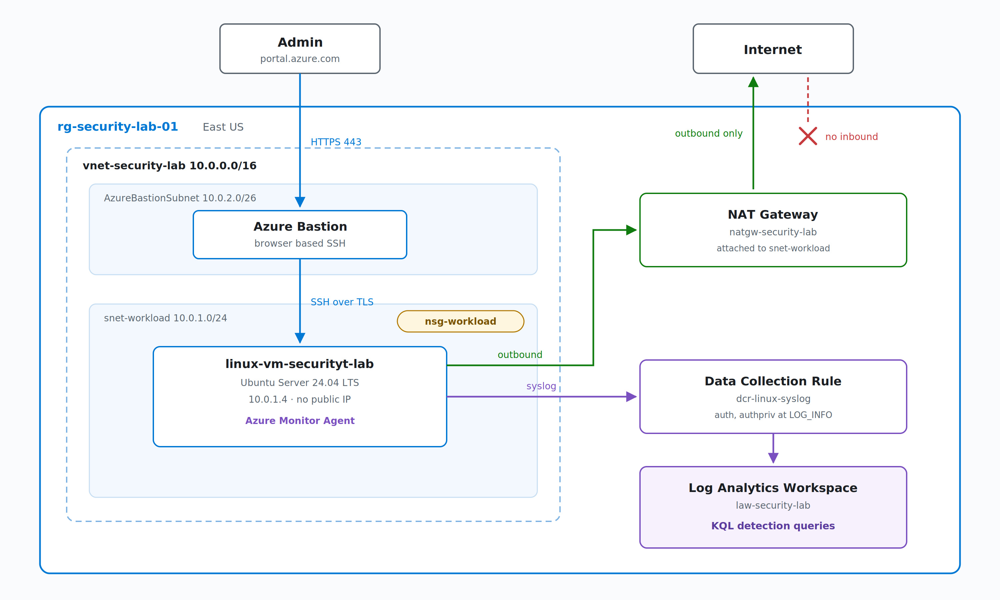
 
The VM has no public IP. Admin access goes through Azure Bastion over TLS.
Outbound traffic leaves through a NAT gateway. Logs flow from the agent to a
Data Collection Rule to the workspace, where the detection queries run.
 
---
 
## Environment
 
| Resource | Name | Purpose |
| --- | --- | --- |
| Resource group | `rg-security-lab-01` | Holds every resource, deleted in one step at teardown |
| Virtual network | `vnet-security-lab` (`10.0.0.0/16`) | Two subnets: workload and Bastion |
| Network security group | `nsg-workload` | Attached to the workload subnet |
| Virtual machine | `linux-vm-securityt-lab` | Ubuntu 24.04, `10.0.1.4`, no public IP |
| Bastion | Azure Bastion | Browser based SSH, no exposed port |
| NAT gateway | `natgw-security-lab` | Outbound only internet access |
| Log Analytics workspace | `law-security-lab` | Central log store and query engine |
| Data collection rule | `dcr-linux-syslog` | Collects `auth` and `authpriv` |
 
---
 
## 1. Network and VM
 
A `/16` virtual network split into two subnets: `snet-workload` (`10.0.1.0/24`)
for the VM and `AzureBastionSubnet` (`10.0.2.0/26`) for Bastion. The NSG on the
workload subnet keeps Azure's default rules, which already deny inbound traffic
from the internet.
 
The VM is deployed with **no public IP** and SSH key authentication only. With
no public IP and no exposed port, there is no attack surface to brute force.
Access is through Bastion instead.
 
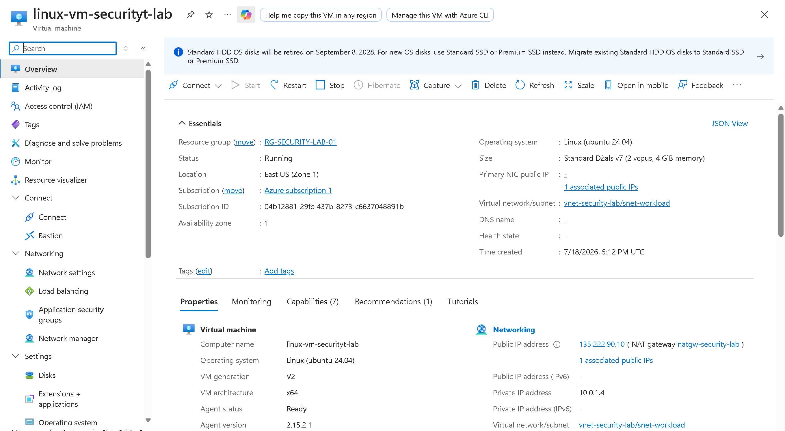
 
Supporting: [resource group](screenshots/resource-group-overview.png) ·
[subnets](screenshots/vnet-subnets.png) ·
[NSG inbound rules](screenshots/nsg-inbound-security-rules.png)
 
---
 
## 2. Log Collection Pipeline
 
This is the cloud version of an agent shipping logs to a SIEM.
 
- **Log Analytics workspace** is the central store and query engine.
- **Azure Monitor Agent** runs on the VM and ships logs out.
- **Data Collection Rule** tells the agent what to collect and where to send it.
The DCR collects only the `auth` and `authpriv` facilities at `LOG_INFO`, which
is where SSH, sudo, su, and login events live. Every other facility is set to
None to keep ingestion focused and cheap.
 
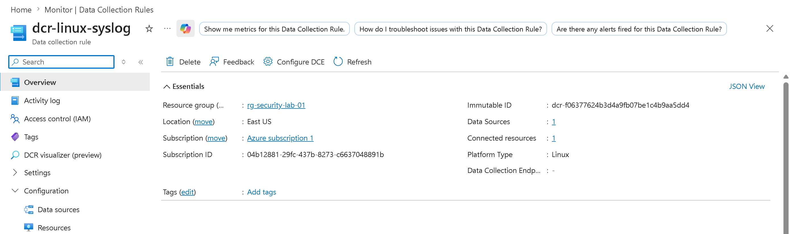
 
`Data Sources: 1` and `Connected resources: 1` are the two values that confirm
the rule is scoped correctly and actually bound to the VM.
 
Supporting: [syslog facilities in the DCR](screenshots/dcr-data-sources-linux-syslog.png)
 
---
 
## 3. Troubleshooting: the agent could not reach Azure
 
After the pipeline was built, no logs arrived. The agent was installed and
running, the DCR was correctly associated, but the workspace stayed empty.
 
The agent error log showed the cause:
 
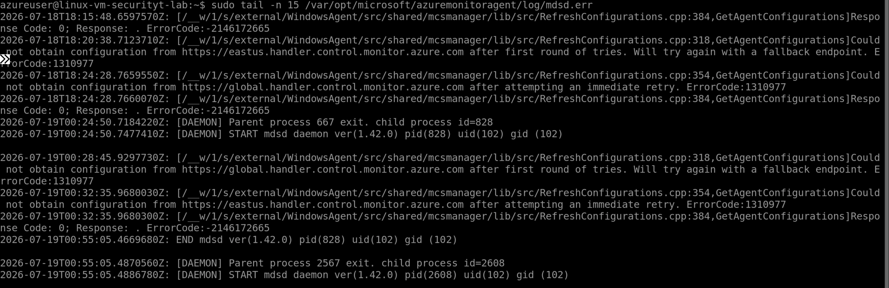
 
> Could not obtain configuration from
> `https://global.handler.control.monitor.azure.com`
 
The VM had no outbound internet path, so the agent could not download its
configuration. This traced back to the security design: a VM with no public IP
also has no default outbound access, because Azure retired implicit outbound
for new deployments. The NSG was not blocking it. There was simply no egress
route at all.
 
The important distinction: outbound was **permitted** by the NSG, but no egress
**path** existed. Filtering and routing are two different things.
 
The fix was a **NAT gateway** attached to the workload subnet, which gives
outbound only access. Nothing inbound changes, so the security posture holds.
 
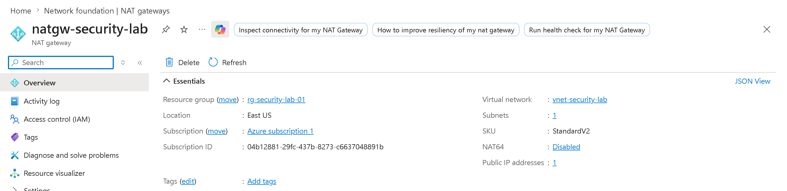
 
With egress in place, the agent pulled its config and the pipeline came alive:
`curl` returned the NAT gateway's public IP, the config cache populated, and the
agent wrote its rsyslog forwarding rule.
 
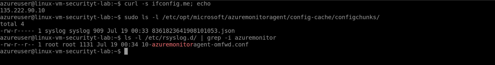
 
Supporting: [auth events on the VM before ingestion](screenshots/local-auth-events-in-authlog.png)
 
---
 
## 4. Detection Queries
 
Test activity was generated on the VM (sudo commands, failed `su - root`
attempts, and a `useradd`), then queried in the workspace. All four queries
are in [`queries/`](queries).
 
**Confirm logs are arriving**
 
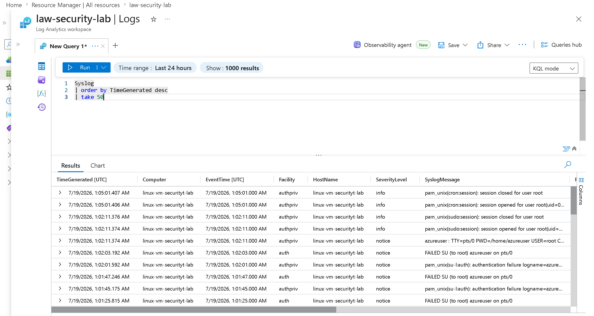
 
Auth and authpriv events from the VM, and nothing else, which confirms the DCR
scope. ([full column view](screenshots/first-general-kql-timegenerated-take50-query-result-2.png))
 
**[Privilege escalation](queries/privilege-escalation.kql)** finds commands run
through sudo. sudo events are identified by `ProcessName`, not by the message
text, so filtering the message body for "sudo" returns nothing. This was a real
miss that the query file documents.
 
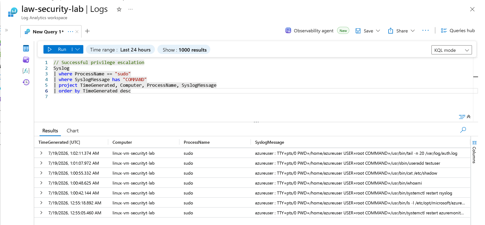
 
**[Failed authentication](queries/failed-authentication.kql)** catches failed
logins. One failed `su` writes two lines for the same event, a `FAILED SU` from
su and an `authentication failure` from PAM, so an alert rule would need to
dedupe.
 
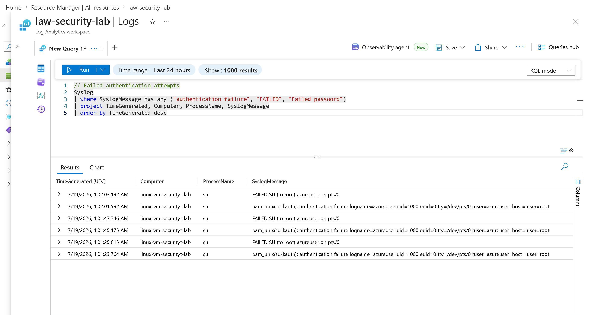
 
**[User account creation](queries/user-account-creation.kql)** flags new local
accounts, a common persistence signal. It correlates with the sudo command that
created the account at the same timestamp.
 
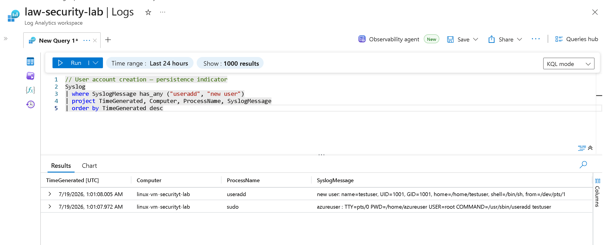
 
**[Event volume by process](queries/event-volume-by-process.kql)** is a triage
baseline and a scope check. Only auth and authpriv processes appear, confirming
the DCR is collecting exactly what it was set to.
 
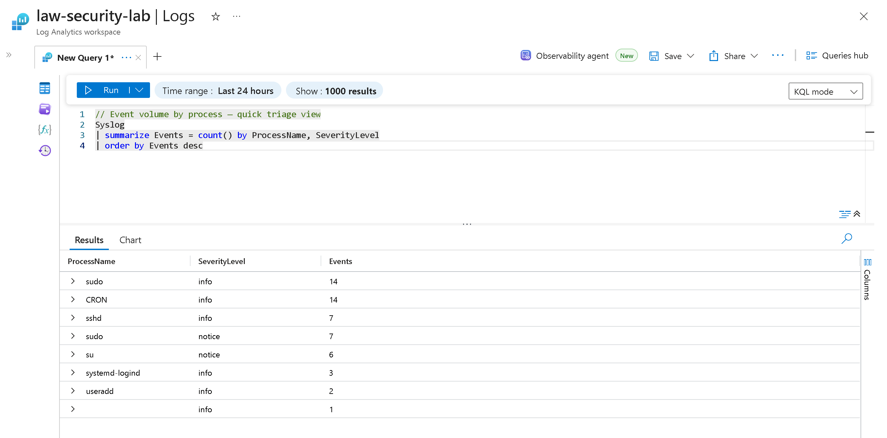
 
---
 
## Cost and Teardown
 
Run on Pay As You Go with a budget alert set. The whole environment was torn
down after the session by deleting `rg-security-lab-01`, which removes every
resource in one step. Bastion and the NAT gateway are the only pieces that bill
by the hour, so nothing is left running.
 
---
 
## Key Takeaways
 
- A VM with no public IP has no default outbound access. Egress needs a NAT
  gateway, a load balancer, or a public IP, and this is now a deliberate design
  choice, not an automatic default.
- NSG rules control filtering, not routing. Traffic can be permitted and still
  have nowhere to go.
- The Azure Monitor Agent needs outbound reachability to pull its DCR config.
  An empty config cache points to connectivity, not to a bad rule.
- Log fields matter. sudo events carry the process in `ProcessName`, not in the
  message body, and a single failed login can log twice from two sources.
